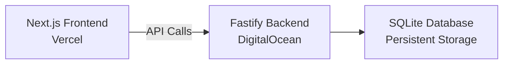

# Employee Management System

[](https://employee-management-app-mscr.vercel.app)
[](https://employee-management-app-c6psx.ondigitalocean.app/health)
[](https://www.typescriptlang.org/)
[](https://nextjs.org/)
[](https://www.fastify.io/)
[]([https://vercel.com/](https://employee-management-app-mscr.vercel.app/))
[]([https://www.digitalocean.com/](https://employee-management-app-c6psx.ondigitalocean.app/api/employees))

> **Modern full-stack employee management application with separate frontend/backend deployments**

## 🚀 Live Application

| Service | URL | Status |
|---------|-----|--------|
| **Frontend** | [employee-management-app-mscr.vercel.app](https://employee-management-app-mscr.vercel.app) | [](https://employee-management-app-mscr.vercel.app) |
| **API** | [employee-management-app-c6psx.ondigitalocean.app](https://employee-management-app-c6psx.ondigitalocean.app/api/employees) | [](https://employee-management-app-c6psx.ondigitalocean.app/health) |

## ⚡ Features

- **CRUD Operations** - Create, read, update, delete employees
- **Real-time Search** - Instant search with debouncing
- **Responsive Design** - Mobile-first approach
- **Type Safety** - 100% TypeScript coverage
- **High Performance** - Optimized API responses
- **Production Ready** - Scalable architecture

## 🛠 Tech Stack

### Frontend
```
Next.js 14 + React + TypeScript + Tailwind CSS + TanStack Query
```
**Deployed on:** Vercel

### Backend
```
Fastify + Prisma + SQLite + TypeScript + Docker
```
**Deployed on:** DigitalOcean App Platform

## 🏃‍♂️ Quick Start

```bash
# Clone & install
git clone https://github.com/swarajreddy10/Employee-management-app.git
cd Employee-management-app && yarn install

# Start development
yarn dev
```

**Development URLs:**
- Frontend: `http://localhost:3000`
- API: `http://localhost:8000/api`

## 📋 API Reference

| Method | Endpoint | Description |
|--------|----------|-------------|
| `GET` | `/api/employees` | Get all employees |
| `GET` | `/api/employees?search={query}` | Search employees |
| `POST` | `/api/employees` | Create employee |
| `PUT` | `/api/employees/{id}` | Update employee |
| `DELETE` | `/api/employees/{id}` | Delete employee |
| `GET` | `/health` | Health check |

**Example:**
```bash
curl https://employee-management-app-c6psx.ondigitalocean.app/api/employees
```

## 🏗 Architecture



## ⚙️ Environment Setup

**Backend** (`.env`)
```env
DATABASE_URL=file:./dev.db
NODE_ENV=development
PORT=8000
```

**Frontend** (`.env.local`)
```env
NEXT_PUBLIC_API_URL=http://localhost:8000/api
```

## 🧪 Testing

```bash
# Backend tests
cd backend && yarn test

# Health check
curl https://employee-management-app-c6psx.ondigitalocean.app/health
```

## 📊 Performance

- **API Response:** < 50ms
- **Frontend Load:** < 2s
- **Database:** Optimized with Prisma
- **CDN:** Global edge caching

## 👨‍💻 Developer

**Swaraj Reddy**  
[](https://github.com/swarajreddy10)
[](https://linkedin.com/in/swarajreddy)

---

[](https://github.com/swarajreddy10/Employee-management-app)

**[🚀 Try Live Demo](https://employee-management-app-mscr.vercel.app)**
